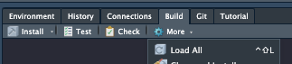
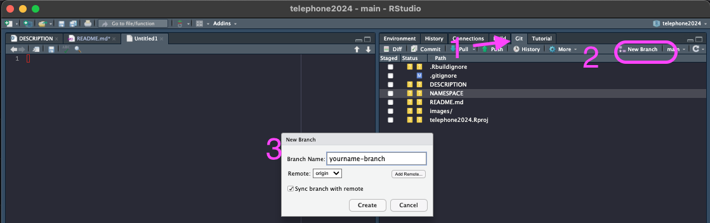
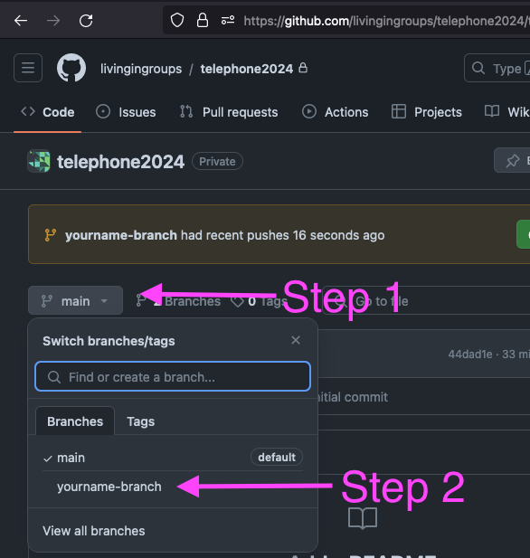
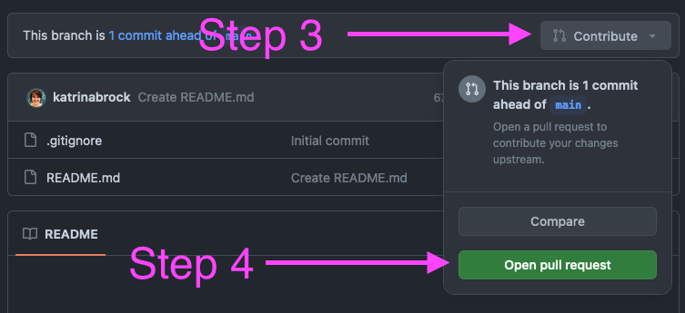
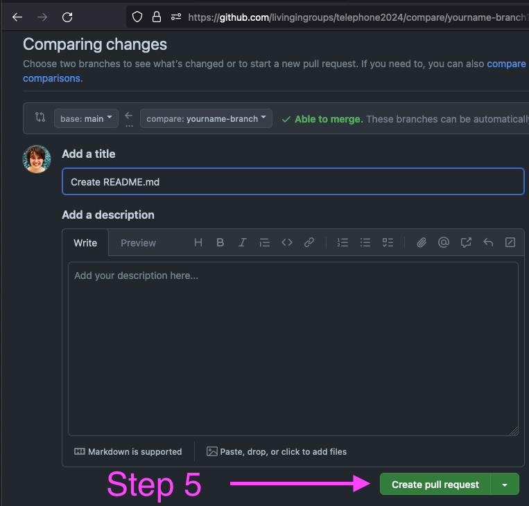

# Agenda

## 0 Setup

### Whole Group

-   Ensure everyone is a member of livingingroups org. (Or has access to this repo.)

-   Brock to create and push skeleton functions for everyone

### Individually

-   Clone this repo and create an RStudio or VSCode project from it.

-   "Load all"

    

-   Make sure you can run your the `telephone(word)` function and your function (your_name(word)\`.

-   Make sure you can find your personal R file.

### ⬜ Whiteboard overview

-   Determine who will review who

-   Conceptual explanation of telephone game

-   Demo of existing relevant R/python files: (You don't need to understand each line by line.)

    -   `brock.py` - You should understand input, output, and how to use `all_english_words` vector in your function.

    -   `marius.py` - You should understand input, output.

    -   `telephone(word)` - You should understand the what this function is doing and how your function will fit into it.

-   Conceptual explanation and diagram of what is happening with git, github and locally in the next 3 sections.

## 1. Update your function, push it, make a PR

-   Create a new branch

    

    -   We are not working with forks so you can leave the remote as `origin`

-   Make changes to your function:

    -   Make a change

    -   Run Load All

    -   Test out your function

-   Commit your change (Commit button in Git tab)

-   Push your change (Push Button in Git tab)

-   Create a pull request

    -   **Switch over from RStudio or VSCode to Github, open** <https://github.com/livingingroups/telephone2024>

    -   You will likely see a prompt to create a PR from your recently pushed branch.

    -   If you don't, select your branch from the dropdown.

        

## 2. Review another person's code. (Make sure it runs and works.)

-   In Rstudio or VSCode or with git command line, "Pull" from remote.

-   Switch to the branch of the person you're reviewing.

-   Run Load All

-   Test out *their* function (`their_name(word)` )

-   If it works, find their pull request here: <https://github.com/livingingroups/telephone2024/pulls> and click Approve. You can then click "merge".

-   If it doesn't work, let them know...they can update and try again.

## 3. Demo: Running form main...everyone's code together

## 4. (Time Allowing) Make comments on another person's code.

⬜ Whiteboard explanation

-   Pull

-   Checkout main

-   Create a new branch `yourname-theirname-comments`

-   Open their R file, look at what they've done and make 2-3 suggestions.

-   Commit

-   Push

-   Make a PR (set it to Draft status). - Your comments will show up as the diff.

## 5. Parting Notes

-   Ideally, testing would be part of this. If the author had written tests, it would speed up the reviewer's process.

-   Whiteboard: Explanation of forks/multiple remotes.
